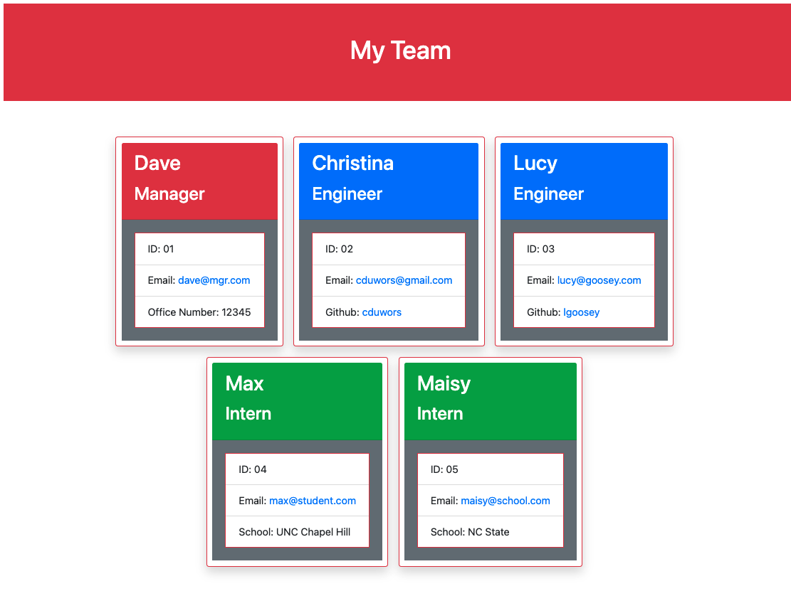

# Team Profile Generator

## Description

A command line app that produces an html team page showing development team members of Manager, Engineer, and Intern. Including identifying and contact information for each employee. View a live demo here: https://drive.google.com/file/d/1Bsm5Ss_UfDPkkDcluiUVM7j_1YaufR6b/view.

## Table of Contents

- [Installation](#installation)
- [Usage](#usage)
- [License](#license)
- [Contributing](#contributing)
- [Tests](#tests)
- [Questions](#questions)
- [Screenshot](#screenshot)

## Installation

Download a copy from gitHub.

## Usage

Anyone may download this code and then make changes for personal taste.

## License

This project not currently licensed.

## Contributing

Feel free to send me ideas on how to improve this app!

## Tests

N/A

## Questions

See more details at https://www.github.com/cduwors or contact christinaduwors@gmail.com.

## Screenshot

